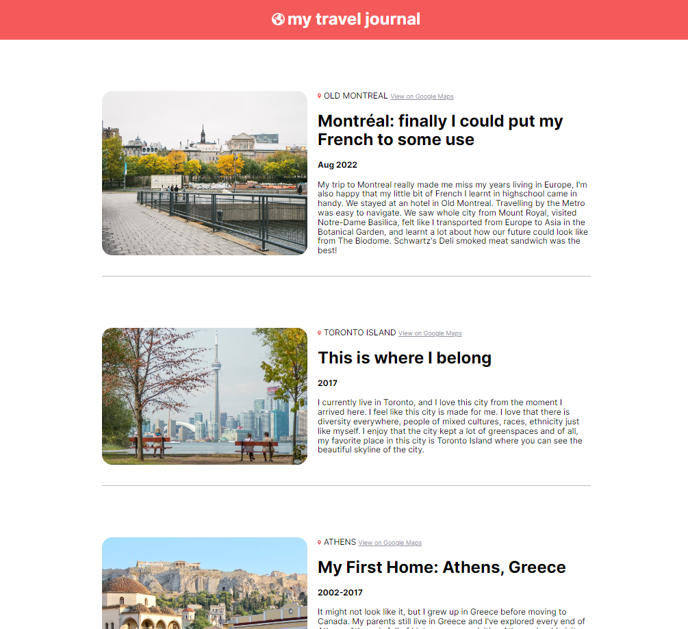

# Travel Blog

Travel blog website made with React to practice using components, props and mapping data into components

**Link to project:** https://brianbud-travel-blog.netlify.app/



## How It's Made:

**Tech used:** REACT, JSX, CSS

## Lessons Learned:

This website was build following a Figma design.
I made this to help me learn more about working with reusable components and also on how to destructure props.
The most important thing I learn is how useful an array method like .map() is for mapping components as well as to map data into components.

Quick start:

```
$ yarn # npm install
$ yarn build # npm run build
```

## Development

Run Webpack in watch-mode to continually compile the JavaScript as you work:

```
$ yarn watch # npm run watch
```
